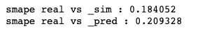

## IDAO CONTEST 2020

### Jupyter notebook file descriprtion :
1. <b>2_IDAO2020.ipynb</b> 
   - Models : 
     - Neural Network output vector 3 x 1
   - Note :
     - delete sat_id 
     - use x_sim, y_sim, z_sim to predict x, y, z respectively as a vector
   - Result
     - has big number of loss qrround 45841290.3181 for traiming
2. <b>2a_IDAO2020.ipynb</b>
   - Models : 
     - Same as before but delete normalization
   - Result
     - has big number of loss qrround 45972115.7892 for traiming
3. <b>3_IDAO2020.ipynb</b>
   - Models : 
     - Using linear regression by sklearn 
     - predict label one by one (use x_sim, y_sim, z_sim to predict x, y, z one by one)
   - Note :
     - sat_id not used to predict the data
   - Result
     - prediction result was so close with the simulation result [see graph](https://github.com/ayunimatulf/IDAO2020/tree/master/pict/3_IDAO2020_result.png)
     - SMAPE output were below : (smape from prediction to real should be smaller than simulation to real) </br>
         
4. <b>3a_IDAO2020.ipynb</b>
   - Models
     - same as above but not used normalization
   - Result:
     - Have same value smape as above
         
5. <b>4a_IDAO2020.ipynb</b>
    - Models
      - Using LInier Regression and use x_sim to predict x, y_sim to predict y, and z_sim to predict z
    - Note
      - sat_id not used to predict
    - Reuslt
      - Sampe from prediction to real is little bit smaller than before
         
6. <b>5_IDAO2020.ipynb</b>
    - Models 
      - Using neural network but add some layers in num of node in each layer
      - Predict x,y,z as a vector 1x3 use x_sim, y_sim, z_sim
    - Note
      - Not use sat_id as a predictor
    - Result
      - Has result similiar with above but so better if compare with first strategy <br>
         
7. <b>5a_IDAO2020.ipynb<</b>
    - Models 
      - Using neural network and predict each label by the simulation and sat id (predict x by used sat_id and x_sim, y by used sat_id and y_sim, and also same for z)
      - Predict x,y,z as a vector 1x3 use x_sim, y_sim, z_sim
    - Result
      - Has result better than previous strategy
         
8. <b>6_IDAO2020.ipynb</b>
    - Models 
      - Use regressor XGBRegressor 
      - Using x_sim, y_sim, z_sim to predict x, y, z one by one 
    - Note:
        - Not used sat_id as predictor
    - Result
      - Has result quite bad compare to Linear Regression
         
9.  <b>7_IDAO2020..ipynb</b>
    - Models :
      - Using Neural network to predict each label
      - To choose the predictor by find correlation each label (used label that has high correlation altough it sampled) with the target using this dictonary :
       ```python
        {'x':['sat_id', 'x_sim', 'y_sim', 'Vz_sim'], 'y':['sat_id','x_sim','y_sim','Vx_sim'], 'z':['sat_id','y_sim','z_sim','Vy_sim']}
        ```
        mean to predict x will be used sat_id, x_sim, y_sim, and Vz_sim. To see the correlation number vam see in [cek_correlation.ipynb](https://github.com/ayunimatulf/IDAO2020/blob/master/cek_correlation.ipynb)
10. <b>cek_correlation.ipynb</b>
    - Desc:
      - Finding correlation between target and predictor and to make sure the correlation is valid in each condition also tried to sampling the dataframe
#### Note
- Has been tried using RandomForestRegressor and SVR from sklearn byt the result was so bad

TO DO : 
- [x] ~~Add detail each jupyter file in description~~
- [ ] Tuning parameters
- [ ] Create submission